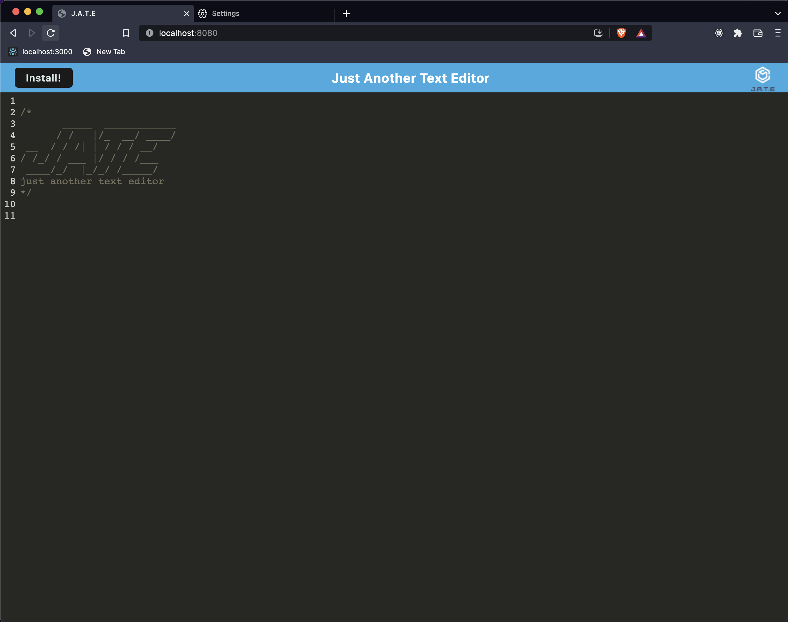

# Text-Editor

## Description
J.A.T.E is a text-editor with javascript highlighting. Allowing you the ability to download on any device. if your ever in a place and you come up with something you want to try = but are not around a computer. Well here is the solution for you 

## Table of Contents

- [Installation](#installation)
- [Usage](#usage)
- [Credits](#credits)
- [License](#license)

## Installation

Go to https://vast-garden-46739.herokuapp.com

## Usage

## Credits

Penn University Full Stack Bootcamp

## License

MIT License

Copyright (c) 2022 Rayman244

Permission is hereby granted, free of charge, to any person obtaining a copy
of this software and associated documentation files (the "Software"), to deal
in the Software without restriction, including without limitation the rights
to use, copy, modify, merge, publish, distribute, sublicense, and/or sell
copies of the Software, and to permit persons to whom the Software is
furnished to do so, subject to the following conditions:

The above copyright notice and this permission notice shall be included in all
copies or substantial portions of the Software.

THE SOFTWARE IS PROVIDED "AS IS", WITHOUT WARRANTY OF ANY KIND, EXPRESS OR
IMPLIED, INCLUDING BUT NOT LIMITED TO THE WARRANTIES OF MERCHANTABILITY,
FITNESS FOR A PARTICULAR PURPOSE AND NONINFRINGEMENT. IN NO EVENT SHALL THE
AUTHORS OR COPYRIGHT HOLDERS BE LIABLE FOR ANY CLAIM, DAMAGES OR OTHER
LIABILITY, WHETHER IN AN ACTION OF CONTRACT, TORT OR OTHERWISE, ARISING FROM,
OUT OF OR IN CONNECTION WITH THE SOFTWARE OR THE USE OR OTHER DEALINGS IN THE
SOFTWARE.

## Badges

## Features

- Add a code snippet 
- Saves code snippet to database
- Full offline functionality
- Downloadable

## How to Contribute

https://github.com/Rayman244/Text-Editor
## Tests

 No errors to report

 ## Questions
 message me on Github https://github.com/Rayman244/
 email me at [rayhewitt42@icloud.com](mailto:rayhewitt42@icloud.com)
